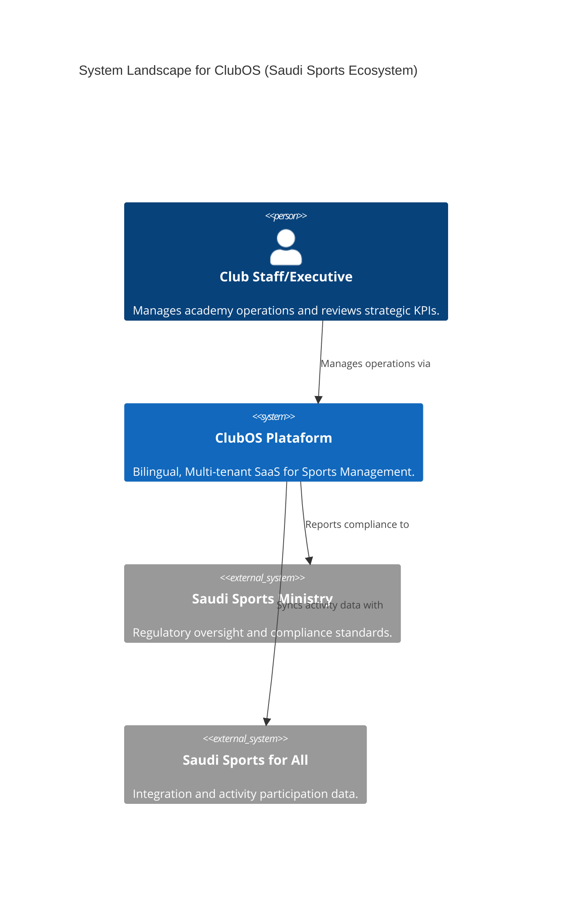
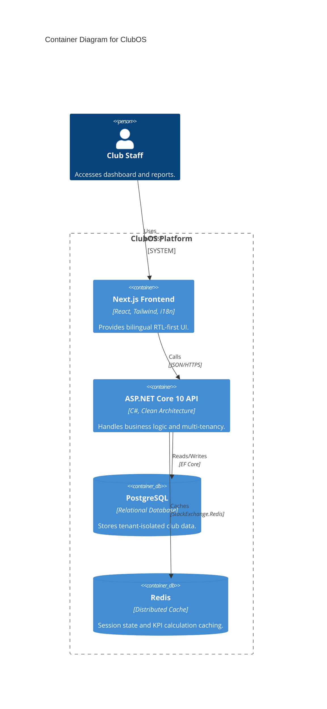

# ClubOS — Multi-Tenant B2B SaaS for Saudi Sports Academies
> **نظام إدارة الأكاديميات الرياضية** | Demo Client: Al-Faisaly FC (Harmah, Saudi Arabia)

[](https://dotnet.microsoft.com/)
[](LICENSE)
[](https://www.vision2030.gov.sa/)

---

## 🏛️ Architecture (C4 Model)





---

## 🏟️ Overview

ClubOS is a **Clean Architecture** ASP.NET Core 10 Web API for managing sports academies in Saudi Arabia.
It is **multi-tenant** (shared DB, column-level isolation), fully **bilingual** (Arabic/English, RTL-first),
and embeds Saudi governance pillars (Roles, Policies, Decision Systems, Feedback Loops).

---

## 📁 Folder Structure

```
ClubOS/
├── src/
│   ├── ClubOS.Domain/          ← Entities, Enums, Events, Exceptions, Interfaces
│   ├── ClubOS.Application/     ← CQRS (MediatR), Behaviors, Validators, DTOs
│   ├── ClubOS.Infrastructure/  ← EF Core, PostgreSQL, Redis, Middleware
│   └── ClubOS.API/             ← Controllers, Program.cs, appsettings.*
├── tests/
│   ├── ClubOS.UnitTests/
│   └── ClubOS.IntegrationTests/
├── Dockerfile
├── docker-compose.yml
└── .github/workflows/ci-cd.yml
```

---

## ⚙️ Prerequisites

| Tool              | Version   |
|-------------------|-----------|
| .NET SDK          | 10.x      |
| Docker Desktop    | 4.x       |
| PostgreSQL client | Optional  |
| Node.js (frontend)| 20.x LTS  |

---

## 🚀 Quick Start (Local — Saudi AST Timezone)

### 1. Clone
```bash
git clone https://github.com/your-org/ClubOS.git
cd ClubOS
```

### 2. Environment variables
Create a `.env` file at the project root (never commit this):
```env
POSTGRES_HOST=postgres
POSTGRES_DB=clubos_dev
POSTGRES_USER=clubos
POSTGRES_PASSWORD=ClubOS_Dev_2026!
REDIS_HOST=redis
JWT_ISSUER=https://auth.clubos.sa
JWT_AUDIENCE=https://api.clubos.sa
JWT_SECRET_KEY=REPLACE_WITH_MINIMUM_64_CHARACTER_RANDOM_SECRET_STRING_HERE
FRONTEND_URL=http://localhost:3000
```

### 3. Start all services
```bash
docker compose up -d
```

> **Timezone Note**: All containers are configured with `TZ=Asia/Riyadh` (AST = UTC+3).
> Saudi midnight = 21:00 UTC the previous day.

### 4. Verify
```bash
curl http://localhost:8080/health
# → {"status":"Healthy"}

# Swagger UI (Dev only)
open http://localhost:8080
```

### 5. Run pgAdmin (optional tools profile)
```bash
docker compose --profile tools up -d pgadmin
open http://localhost:5050
# Login: admin@clubos.sa / ClubOS_Admin_2026!
```

---

## 🗄️ Database Migrations

```bash
# From project root
dotnet ef migrations add InitialCreate \
  --project src/ClubOS.Infrastructure \
  --startup-project src/ClubOS.API

dotnet ef database update \
  --project src/ClubOS.Infrastructure \
  --startup-project src/ClubOS.API
```

---

## 🔐 Authentication

ClubOS uses **JWT Bearer** tokens. Every token **must** carry:

| Claim        | Example Value                          |
|--------------|----------------------------------------|
| `sub`        | `user-uuid`                            |
| `tenant_id`  | `3fa85f64-5717-4562-b3fc-2c963f66afa6` |
| `tenant_slug`| `alfaisaly-fc`                         |
| `role`       | `TenantAdmin`                          |

### Role Hierarchy (Saudi Governance Pillar — Roles)
```
SystemAdmin
  └── TenantAdmin
        └── AcademyManager
              ├── Coach
              └── Staff
```

---

## 🌐 Localization

| Culture | Name             | Direction |
|---------|------------------|-----------|
| ar-SA   | Arabic (Saudi)   | RTL       |
| en-US   | English (US)     | LTR       |

Set culture via `Accept-Language: ar-SA` header or `?culture=ar-SA` query param.

---

## 🏛️ Saudi Governance Pillars

| Pillar           | Implementation                                    |
|------------------|---------------------------------------------------|
| **Roles**        | JWT claims + `[Authorize(Roles="...")]`           |
| **Policies**     | Named policies in `AddAuthorizationBuilder()`     |
| **Decision Systems** | `KpiRecord` entity + KPI dashboard queries   |
| **Feedback Loops** | `FeedbackEntry` entity with lifecycle states    |

---

## ☁️ Azure App Service Deployment Checklist

- [ ] Create **Azure App Service** (Linux, .NET 10 runtime)
- [ ] Set **Application Settings** (env vars replace appsettings secrets):
  - `ASPNETCORE_ENVIRONMENT` → `Production`
  - `ConnectionStrings__DefaultConnection` → Azure Database for PostgreSQL Flexible Server connection string (SSL required)
  - `ConnectionStrings__Redis` → Azure Cache for Redis connection string
  - `Jwt__SecretKey` → Stored in **Azure Key Vault**; use Key Vault reference: `@Microsoft.KeyVault(VaultName=clubos-kv;SecretName=JwtSecretKey)`
  - `Jwt__Issuer`, `Jwt__Audience` → production URLs
  - `FRONTEND_URL` → production Next.js URL
- [ ] Enable **Always On** to avoid cold starts
- [ ] Configure **Health Check** path: `/health`
- [ ] Enable **Managed Identity** for Key Vault access (no stored credentials)
- [ ] Set **WEBSITE_TIME_ZONE** → `Arab Standard Time`
- [ ] Enable **Application Insights** for telemetry
- [ ] Configure **Custom Domain** + **SSL/TLS** certificate
- [ ] Set up **Deployment Slots**: production + staging, then swap
- [ ] Enable **Auto Scaling** rules (CPU > 70% → scale out)
- [ ] Configure **VNet Integration** if PostgreSQL is in a private endpoint
- [ ] Enable **Diagnostic Logs** → stream to Log Analytics Workspace
- [ ] Set `ASPNETCORE_URLS=http://+:8080` (App Service handles TLS termination)

---

## 🧪 Testing

```bash
# Unit tests
dotnet test tests/ClubOS.UnitTests

# Integration tests (requires Docker running)
dotnet test tests/ClubOS.IntegrationTests
```

---

## 📧 Support
- **Email**: support@clubos.sa
- **Docs**: https://docs.clubos.sa
- **Status**: https://status.clubos.sa

---

> Built with ❤️ for Saudi Vision 2030 | بُني بشغف لرؤية المملكة 2030
